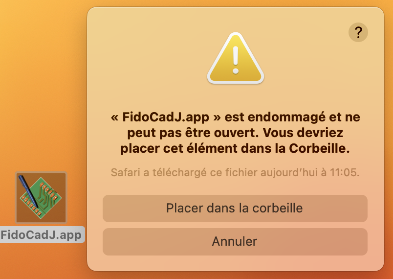

README file for FidoCadJ
========================

Version 0.24.8

Copyright 2007-2023

This file has been written by Davide Bucci and Dante Loi

1. Introduction
	- 1.1 What is FidoCadJ?
	- 1.2 Where can I find FidoCadJ?
	- 1.3 How can I run FidoCadJ?
	- 1.4 Where can I get help?
2. Source files and the FidoCadJ Git directories
	- 2.1 Main directory
	- 2.2 Important classes
	- 2.3 Developers' tools
3. Instructions about compiling and running FidoCadJ
	- 3.1 Build automation tool
	- 3.2 Compile and run the sources on a macOS or a Unix operating system
	- 3.3 Compile and run the sources on a Windows system
	- 3.4 Android
4. Coding conventions
	- 4.1 General rules
	- 4.2 Automated tests
	- 4.3 Static code analysis and the quality of the FidoCadJ source code
5. Help wanted!
	- 5.1 "I want to translate FidoCadJ in my language"
	- 5.2 "I would like to participate to the coding activity"
	- 5.3 Things to do
	- 5.4 Checklist for committers
6. I found a bug...
7. Acknowledgments
8. Licensing


1 - Introduction
================

1.1 What is FidoCadJ?
---------------------

FidoCadJ is an easy to use editor, with a vast library of electrical
symbols and footprints (through hole and SMD). Its drawings can be exported
in several graphic formats (PDF, EPS, PGF for LaTeX, SVG, PNG, JPG). Even though 
it is very simple to use, FidoCadJ can be useful as a basic schematic
capture and electronic design automation (EDA) software.
FidoCadJ is inspired from the old FidoCAD (without "J"), which was a vector
graphic editor for electrical schematics and printed circuit boards.
FidoCAD used a file format containing text, very compact and
perfect for copying and pasting from/into newsgroups and forum messages.
This determined its success among the Italian Usenet community and forums,
from late '90s, as it was quite versatile for simple mechanical drawings as
well. No netlist concept lies behind the drawings, so there is all the
graphical flexibility that a vector drawing software can offer (but no
simulation).

FidoCadJ is the modern, multiplatform successor of FidoCAD, with full
support of UTF-8 text, advanced features, internationalisation and a sleek,
polished user interface with anti-aliasing.

The FidoCadJ user manual is available in English. Translations in French,
Italian, Dutch and Chinese are available, but may not have been updated regularly.
The user interface has been translated into English, French, Italian, Spanish,
German, Chinese, Dutch, Japanese, Greek and Czech.

FidoCadJ runs on the following systems:

- Windows Seven, 8, 10, 11
- All major distributions of Linux.
- macOS 10.8 and following
- Android 4.0 or more recent devices.

At least version 1.9 of Java is required for Windows, Linux and macOS.

1.2 Where can I find FidoCadJ?
------------------------------

Here are the two official FidoCadJ websites. The first one is the generic
website presenting the project:

    http://darwinne.github.io/FidoCadJ/index.html

The second one is the GitHub project, for developers:

    https://github.com/DarwinNE/FidoCadJ

1.3 How can I run FidoCadJ?
---------------------------

If you own a PC running Linux or Windows (or any system supporting Java), you
may download from the GitHub repository the file `fidocadj.jar`. If Java
is correctly installed on your machine, you may just double click on it to
run FidoCadJ. If you are a command line wizard, you may go to the directory
where the file `fidocadj.jar` has been saved and type:

    java -jar fidocadj.jar

If you are a Linux user, and you want install FidoCadJ, you may download
from GitHub repository the source code packed on .zip or .tar.gz archive,
unpack it, and in the FidoCadJ-x.xx.x/ directory type:

    make
    sudo make install

If you use Windows, you might find useful to use the classical installer
contained in the `FidoCadJ_Windows.msi` file. If you run it, it will install
FidoCadJ on your system and you can launch it via the Start menu.

If you own an Apple Macintosh with macOS, you may download the `FidoCadJ_MacOSX.dmg`
bundle and treat it just like any other native application. Since Apple does
not seem to keen to support Java, if you experience some
problems running FidoCadJ, please check you do have a Java runtime
correctly installed on your Mac. This is particularly true if you are using
the macOS Lion/Mountain Lion/Mavericks/etc. operating system. Normally, you
will have to download the Java runtime in a few clicks. I tried my best, but
the situation in 2007 was different from the current one and Apple used to
warmly welcome Java developers back then...

If you just have to run the application bundle and not develop code, you will not need
to install Java as everything needed is already contained in the application, that
is self-sufficient. Unfortunately, the gatekeeper function of the last operating
systems may show a very misleading error when trying to execute it. Something
like "FidoCadJ.app is damaged and can’t be opened. You should move it to the Trash".
I have nothing against an operating system that warns an unexperienced user against
executing code downloaded from the internet, but the error can not be so misleading
and should at least point the user towards the origin of the problem!

Here is the relevant GitHub issue: https://github.com/DarwinNE/FidoCadJ/issues/198

I tried downloading FidoCadJ 0.24.8 on a brand new MacBook Pro M2 running
macOS Ventura 13.3. At first the system asks to download and install Rosetta.
Then, here is the error shown on by the French macOS Ventura 13.3
OS:



To fix this I had to do three things:

1 - Open a terminal and type xattr -c /Applications/FidoCadJ.app (if you have
    already copied FidoCadJ.app on the Applications folder. Otherwise, specify
    the path to the file in your system.) You must have admin access to the computer
    to do this and you may have to authorize the Terminal.app application to modify
    the files in the directory you are working.
2 - Right click on the executable and select "open".
3 - Then, the system asks me if I really want to run the software (downloaded
    on an untrusted source). I selected "Yes" (at your risk and peril!)

The xattr stuff is required because macOS activates the extended attribute
"quarantine" on the downloaded file. The system refuses to run software with
this attribute and shows the error. The error is very misleading because it
lets the user think that the archive is corrupted even if it is not the case!

If you have a way to solve this problem that does not require accessing to the
terminal, please participate to the GitHub issue linked above.

For Android, we had to develop a completely new application: you should
download and install the APK file containing it. Most devices complain loudly
when you install a file which does not come from a store. Check carefully
where you downloaded it: the ONLY official location where distribution files
are put for FidoCadJ project is on the official GitHub page.

If there is a Greek letter after the version number of FidoCadJ,
this means that you are using a preliminary version of this program.
Basically, you are warned: those versions may be unstable!

FidoCadJ is distributed in the hope that it will be useful, but WITHOUT ANY
WARRANTY; without even the implied warranty of MERCHANTABILITY or FITNESS FOR
A PARTICULAR PURPOSE.

1.4 Where can I get help?
-------------------------

If you feel lost, you can have a look at the manuals. Languages different from
English might be outdated or no more listed:

https://github.com/DarwinNE/FidoCadJ/releases

(search for the PDF files!)

If you need help, you can post a question as a [GitHub issue](
https://github.com/DarwinNE/FidoCadJ/issues).


2 - Source files and the FidoCadJ Git directories
=================================================
You may download the complete source repository by
using Git from the GitHub repository.
```
git clone https://github.com/DarwinNE/FidoCadJ.git
```

2.1 Main directory
----------------------------------------------------------------------
In the following table you find a description of the main directory of
FidoCadJ source files.

| File                 | DIR | Comments                                        |
| -------------------- |:---:| ----------------------------------------------- |
| `bin/`               |  X  | All the compiled classes and resources          |
| `busy being born/`   |  X  | Screenshots of FidoCadJ                         |
| `dev_tools`          |  X  | Developers' tools for compile, run and test     |
| `doc/`               |  X  | Contains all Javadoc produced HTML files        |
| `gpl-3.0.txt`        |     | GNU General Public Licence version 3            |
| `icons/`             |  X  | All icons (made with Gimp)                      |
| `jar/`               |  X  | Directory for jar and manifest files            |
| `makefile`           |     | File which defines automated build system rules |
| `manual/`            |  X  | All the LaTeX manuals sources                   |
| `NEWS.txt`           |     | The big news, for each version tagged           |
| `OSes/`              |  X  | Specific things for some OSes; Android app here |
| `README.md`          |     | This file                                       |
| `SECURITY.md`        |     | Security policies                               |
| `src/`               |  X  | Contains all the Java source files              |
| `test/`              |  X  | Automated tests for FidoCadJ                    |

2.2 Important classes
----------------------------------------------------------------------

Important classes in `src/fidocadj/` are:

| Path                        | Description                     |
| --------------------------- | ------------------------------- |
| `FidoMain.java`             | Starting point, with "main"     |
| `FidoFrame.java`            | Editor windows                  |
| `primitives/*.java`         | The graphic primitives          |
| `dialogs/*.java`            | All the Swing dialogs           |
| `circuit/CircuitPanel.java` | Swing editor panel              |
| `circuit/*`                 | Low level editing classes (MVC) |

2.3 Developers' tools
----------------------------------------------------------------------
The `dev_tools` directory, contains all the scripts to compile, build,
run and test FidoCadJ.

| Tool                 | Description                                     |
| -------------------- | ----------------------------------------------- |
| `checkstyle.sh`      | Launch Checkstyle with rules in `rules.xml`     |
| `clean`              | Erase all the compiled classes                  |
| `cleanall`           | Do a clean, erase `fidocadj.jar`, Javadocs      |
| `compile`            | Compile FidoCadJ                                |
| `count`              | Do a `wc` (word count!) on all Java sources     |
| `createdoc`          | Run Javadoc on all source files                 |
| `createjar`          | Prepare `fidocadj.jar`                          |
| `createdist-macos`   | Create a distribution package for MacOS         |
| `fidocadj_check.txt` | Current result of `checkstyle.sh`               |
| `fidocadj_cpd.txt`   | Current result of copy/paste detector (pmd)     |
| `fidocadj_pmd.html`  | Current result of pmd checks                    |
| `pmd.sh`             | Launch pmd for warnings and copy/paste detector |
| `profile`            | Launch a profiler (jip)                         |
| `rules.xml`          | Set of coding style rules for Checklist         |
| `run`                | Run FidoCadJ                                    |
| `sign.sh`            | Create the signature for the applet             |
| `winbuild.bat`       | Build and run script for Windows (see §3.2)     |

3 - Instructions about compiling and running FidoCadJ
=====================================================

Ok, you just forked the FidoCadJ project in GitHub.

Good :smile:

FidoCadJ is a pure Java project, and for many reasons we prefer to use a good
text editor as well as a few command line scripts, in order to compile and
run the code on which we are working.
You will thus find in the main directory (see section 2 of this file) several
scripts which will be useful for you, especially if you are working in a
Unix-like environment.
If you prefer to use some kind of IDE such as Eclipse, you may try, but we
do not provide assistance with those IDE's and we will always refer to the scripts
we wrote. And no, we will not change our habits, sorry :smile:

3.1 Build automation tool
-----------------------------------------------------------------------
The FidoCadJ project has a build automation system, based on `make`.
The tabled make rules have been implemented.

| Rule                 | Description                                     |
| -------------------- | ----------------------------------------------- |
| `make`               | Compile FidoCadJ (implicit)                     |
| `make clean`         | Erase all the compiled classes                  |
| `make cleanall`      | Do a clean, erase `fidocadj.jar`, Javadocs      |
| `make compile`       | Compile FidoCadJ (explicit)                     |
| `make createdoc`     | Run Javadoc on all source files                 |
| `make createjar`     | Prepare `jar/fidocadj.jar`                      |
| `make rebuild`       | Do a clean and then run FidoCadJ                |
| `make run`           | Run FidoCadJ                                    |

3.2 Compile and run the sources on a macOS or a Unix operating system
----------------------------------------------------------------------

If you are using macOS (>=10.8) or an Unix system (GNU/Linux included), just
open up a terminal window, go into the main directory of FidoCadJ and type:

    make rebuild

FidoCadJ should be automatically compiled and launched. You can use the
following script to create a JAR archive in the `jar/` directory:

    make createjar

If you want to study the FidoCadJ source code, run the `make createdoc` script
to obtain the Javadoc description.

3.3 Compile and run the sources on a Windows system
---------------------------------------------------

The provided scripts do not work on Microsoft Windows.
Kohta Ozaki has written a build/run script for Windows, called `winbuild.bat`
that is present in the `dev_tools` directory.
It must be used with the action to be accomplished, as an argument:

| Argument  | Description                                     |
| --------- | ----------------------------------------------- |
| `run`     | Launch application                              |
| `clean`   | Delete all class files under `.\bin`            |
| `compile` | Compile `FidoMain.java` and related sources[^1] |
| `force`   | Compile source files of all directories[^2]     |
| `rebuild` | Clean and compile                               |

[^1]: This option refers to the compiler resolving dependency.
[^2]: The compiler starts on each source file. Very slow.

Alternatively, you can manually compile with the following
command, in the main directory:

    javac  -g -sourcepath src -classpath bin .\src\fidocadj\FidoMain.java -d bin

To launch the compiled program, you should type:

    java  -classpath .\bin;.\jar;.\jar\  FidoMain

FidoCadJ should start.

3.4 Android
-----------

Android deserves an application which is well separated from the one you
can use on a PC or on a Mac: a smartphone or a table is a quite different
device than a laptop or a desktop computer. Therefore, a lot of effort had
to be put in the development of an appropriate Android app.

You can find the complete sources in `OSes/android/fidocadj/`; there is a
separate `README.md` file which gives some relevant information.

Great care has been put in sharing as much code as possible between the
computer application and the Android one. Therefore, you will always
find their release numbers synchronized.

4 - Coding conventions
=====================================================
For those who want to work on the FidoCadJ source code please use the following
coding style conventions.

4.1 General rules
-------------------

The following coding conventions have been applied for the FidoCadJ source
code:

- the code should be compatible with Java 14
- indent properly, using 4 spaces :ok:
- no tabulation character allowed in sources :ok:
- no trailing spaces :ok:
- blocks delimited by curly braces are indented as follows:

```java
for(i=0; i<10; ++i) {   // Curly brace here
    // indented code (4 spaces)
    System.out.println("I counted up to "+i);
}   // close brace here at the same level of the 'for'
```

- methods are indented as follows: :ok:

```java
void dummy(int i, int j)
{   // put the starting brace here
    System.out.println("Indent code");
}   // put the closing brace here
```

- classes and interfaces are indented as follows: :ok:

```java
class Dummy
{                           // Curly brace here.
    // the rest of the class.
}
```

- switches are indented as follows: :ok:

```java
int dummy(int i)
{
    int j;
    switch(i) {
        case 1:
            j=3;
            break;
        case 2:
            j=2;
            break;
        default:
            j=0
    }
    return j;
}
```

- if an `if` condition spans over multiple lines, put the brace on the following
  line :ok:
- the class names always start with a capital letter :ok:
- variables never start with a capital letter :ok:
- methods never start with a capital letter :ok:
- public classes must be documented with Javadoc syntax :ok:
- public methods must be documented with Javadoc syntax :ok:
- no lines longer than 80 characters :ok:
- Unix-style for newlines is mandatory :ok:
- employing `_` in names of types or variables is deprecated :ok:
- commits should not break the build
- each commit *MUST* include a log
- favor simplicity to unnecessary complication
- favor quality to quantity
- discuss what you want to do BEFORE start coding
- documentation is important. Try to improve it and keep it up-to-date

A Checkstyle ruleset (called `dev_tools/rules.xml`) is employed so to ensure
that those rules will be automatically checked. Points for which a rule has
been activated have been marked with :ok: in the previous list.

Be sure to run checkstyle with `dev_tools/rules.xml` before sending a pull 
request! Have a look at paragraph 4.4 and follow the checklist!

4.2 Automated tests
-------------------

To main a certain degree of quality control when working
on the source code, the FidoCadJ source repository comes with a number of
automated test scripts contained in the directory `test/`.
You may launch all the tests by using the script `dev_tools/all_tests.sh` contained
in this directory, or you may run the tests individually by browsing the
sub-directories containing them. The program is called by using the
`fidocadj.jar` archive which must be contained in the `jar/` directory.
Ensure that this archive is updated with the `make createjar` rule before
launching any test.

The following list briefly describes the provided tests:

`test/all_tests.sh`
:   Run all the available tests.

`test/export/test_export.sh`
:   Test the export on all available file formats. A set of reference files is
    provided, so it might be updated if differences on the export are introduced
    on purpose. If a test has failed, this tells just that the exported file is
    not identical to the model which has been used. You may have a look at the
    log file and at the result of the export. You may decide that it is OK.

`test/messages/test_messages.sh`
:   Test the coherence of all the installed interface languages against the
    reference (which is the English resource file!)

`test/size/test_size.sh`
:   Test if the size calculated for all elements is the same as the one stored
    as a reference. Any change to the way the size is calculated will invalidate
    the test if the size is invalid.

Note that the way those tests are written, they compare the results of an
operation involving FidoCadJ with a reference. In some cases, the reference
can be improved or updated.
In other cases, the differences might just contain unimportant data (such
as version numbers and so on).

4.3 Static code analysis and the quality of the FidoCadJ source code
--------------------------------------------------------------------

Static code analysis is a powerful tool to ensure code quality. It cannot do
miracles, but it is an useful way to avoid common errors. Two tools are
routinely used to ensure that FidoCadJ is of the highest quality possible.
They are [PMD](https://pmd.github.io) and [FindBugs](
http://findbugs.sourceforge.net); those programs are different and somewhat
complementary.

PMD works on the source files directly (see the `dev_tools/pmd.sh` script) and the results
are contained in the file `dev_tools/fidocadj_pmd.html`. This file is contained in the
source file repository and it provides a sort of a traceable metric of the
overall code quality. A copy/paste detection in the code is performed too
and the results are stored in `dev_tools/fidocadj_cpd.txt`.
Effort will be done to reduce the size of those files in the future.

FindBugs runs interactively and analyzes the JAR file resulting after the
compilation and packaging.
The great care applied to the code quality has made sure that FidoCadJ has
had some good results in a [quality assessment analysis](
https://www.cs.usask.ca/documents/technical-reports/2013/TR-2013-01.pdf) done by
researchers working in the Department of Computer Science of the University of
Saskatchewan.

If you work on FidoCadJ code, please do all your best to keep high the quality
of the code you are writing.

As already presented in section 4.1, another tool is employed to ensure that
the coding style is uniform: [Checkstyle](http://checkstyle.sourceforge.net).
The coding rules for Checkstyle are specified in the `dev_tools/rules.xml` file.
Be sure you run Checkstyle with this ruleset to see what it has to be corrected
before creating a pull request.

5 - Help wanted!
================

I am seeking for people interested in participating to the FidoCadJ project.
If you spot a typo (I am not a native English speaker), or an error in the
manual or in the program, any correction is very welcome. I will be very
happy to know what do you think about FidoCadJ. I would be glad to receive
some help: if you know Java and you want to work on the source code you will
be welcome.
If you are not fluent with Java coding, you can participate to the project by
improving the manuals or translating the interface, or just giving an advice.
Feel free to contact me at davbucciNOPE@tiscali.it, or in the GitHub
discussions (the email address is valid without the nope part, but no
attachments, please). It is probably better to open a discussion on GitHub,
in order that the work can eventually be shared and organised between all
developers.

5.1 "I want to translate FidoCadJ in my language"
-------------------------------------------------

FidoCadJ is written in such a way that translating its interface is
particularly easy and does not need any programming skill.
If you have downloaded the source file repository, you should find the
interface resource files in the `bin/` directory.
A language resource file has the name `MessagesBundle_xx.properties`, where
`xx` is the code for the language to which the translation is targeted.
Language code should follow [ISO 639-1](
http://en.wikipedia.org/wiki/List_of_ISO_639-1_codes).

If you have a look at the beginning of the file
`bin/MessagesBundle_en.properties`, you should read something as follow:

    File = File
    New = New
    Open = Open file
    Save = Save
    SaveName = Save as...
    Export = Export
    Print = Print
    Close = Close

    ...

The resources strings are organised in the form `key = value`. For example,
here is the head of the corresponding file for the interface in French, in
the file `bin/MessagesBundle_fr.properties`:

    File = Fichier
    New = Nouveau dessin
    Open = Ouvre un fichier
    Save = Enregistrer
    SaveName = Enregistrer sous un autre nom
    Export = Exporter
    Print = Impression
    Close = Fermer

    ...

That is all. If you want to translate FidoCadJ in your language, you just have
to translate line by line the values in a language resource file, name it
accordingly for your locale and place it in the `bin/` directory.
Pay attention that sometimes there are spaces at the end of the value
strings which need to be kept in place. You may be careful about always
providing complete files, since if a resource is missing, FidoCadJ can abort.

5.2 "I would like to participate to the coding activity"
--------------------------------------------------------

This is very nice of you. We will be happy for that.

You can open an [issue](https://github.com/DarwinNE/FidoCadJ/issues) on GitHub
and declare what you would like to do. We will discuss a little in order to see
if we can find an intersection between what you can do with the FidoCadJ
development strategy. The idea is to keep the work a little bit organised and to
know who does what.

Have a peek to section 4.1 of this `README.md` file to see what coding style
should be applied to the sources.

Apart from that, FidoCadJ is GPL v.3 and this means that if you have the mood
, you can download with Git the source files and play *as you want* with
them. But keep in mind that if you want your contributions be included in the
FidoCadJ main stream, you MUST keep in touch with us via GitHub and you must
discuss about what are you willing to do.

Once you decide what you want to do, you can run the Javadoc utility in order
to get an HTML description of all classes used in FidoCadJ. You will find that
useful to understand the underpinnings of the program. To do that, you can
run `make createdoc`, if you are in a Unix system.

Then comes the hard work... We can help you! Please come to the GitHub
discussions dedicated to FidoCadJ!

5.3 Things to do
----------------

Translate user interface
:   Everything is done on FidoCadJ to make it easy to translate its interface in
    any language. You can contribute to spread FidoCadJ in your country!

Translate manual
:   This is an hard work, but it will be very welcomed by the users of your
    country. You will probably need an idea on how LaTeX works.

YouTube video tutorial
:   People love YouTube videos!

Report bugs
:   Use the bug and artifact tracking system on GitHub.

Export in Gerber format
:   Exporting in graphical vector formats is easy with FidoCadJ. If you want to
    add a file format you just need to know it and implement a Java interface.
    Gerber is highly requested by people working on PCBs.

Unit testing
:   Actually, only high level tests are available. Serious unit testing would be
    much beneficial.

Linux packaging
:   FidoCadJ could be distributed as a deb or a RPM package. Can you prepare
    one?

5.4 Checklist for committers
----------------------------

For the PC and Android app:
- [ ] The code does not break the build for both PC and Android apps.
- [ ] The coding style is conform to paragraph 4.1 of this README.
- [ ] Comments have been added at the relevant places and are up-to date.
- [ ] I ran Checkstyle with `dev_tools/rules.xml` and no issues are reported.

For the PC app:
- [ ] A JAR file has been generated and automated tests have been run.
- [ ] PMD analysis has been run on the code.


6 - I found a bug...
====================

Every program contains bugs and FidoCadJ is no exception. Even if all
the people involved in the development of FidoCadJ pay a lot of attention
at each release, some details could just go unnoticed.
If you are familiar with the GitHub interface, do not hesitate to
fill a bug report at the following address:

https://github.com/DarwinNE/FidoCadJ/issues


7 - Acknowledgments
===================

Code
:   Davide Bucci, josmil1, phylum2, Kohta Ozaki, Dante Loi, miklos80, Manuel Finessi

Beta testers
:   Kagliostro, Bruno Valente, simo85, Stefano Martini, F. Bertolazzi,
    Emanuele Baggetta, Celsius, Andrea D'Amore, Olaf Marzocchi, Werner
    Randelshofer, Zeno Martini, Electrodomus, IsidoroKZ, Gustavo
    ... and many others!

Documentation review
:   Carlo Stemberger, Dante Loi (README.md)

Translations
:   Davide Bucci (it, en, fr), Pasu (en), Olaf Marzocchi (ge),
    Geo Cherchetout (fr), androu1 (es), sbcne (es), Miles Qin "qhg007" (zh),
    DirtyDeeds (en), chokewood (nl), Kohta Ozaki (ja), Chemik582 (cs),
    Pietro Baima (it), simo85 (es)

Libraries
:   Lorenzo Lutti, Fabrizio Mileto, DirtyDeeds, Electrodomus, IHRaM group,
    EY group coordinated by simo85

Website
:   Davide Bucci, Federica Garin, Emanuele Baggetta, Sergio Juanez

Icons used in FidoCadJ
: https://pictogrammers.com/libraries/

Code snippets included in FidoCadJ
:   - http://www.centerkey.com/java/browser/
    - http://www.cse.unsw.edu.au/~lambert/splines/natcubic.html
    - http://jroller.com/santhosh/entry/enhanced_scrolling_in_swing
    - http://www.thoughtsabout.net/blog/archives/000044.html
    - http://www.javareference.com/jrexamples/viewexample.jsp?id=99
    - http://elliotth.blogspot.com/2004/09/cocoa-like-search-field-for-java.html
    - http://stackoverflow.com/questions/3775694/deleting-folder-from-java

When possible, the authors of the snippets have been contacted to gain
explicit permission of using the code in an open source project. If you own
the copyright of some of the reused code and you do not agree on its
inclusion in the FidoCadJ project, open an Issue on GitHub and we will remove
the offending code as fast as we can.


8 - Licensing
=============

FidoCadJ is distributed with the GPL v. 3 license:

    FidoCadJ is free software: you can redistribute it and/or modify
    it under the terms of the GNU General Public License as published by
    the Free Software Foundation, either version 3 of the License, or
    (at your option) any later version.

    FidoCadJ is distributed in the hope that it will be useful,
    but WITHOUT ANY WARRANTY; without even the implied warranty of
    MERCHANTABILITY or FITNESS FOR A PARTICULAR PURPOSE.  See the
    GNU General Public License for more details.

    You should have received a copy of the GNU General Public License
    along with FidoCadJ.  If not, see <http://www.gnu.org/licenses/>.

The file `glyphlist.txt` employed for the export towards the PDF format is
distributed using the Apache license 2.0. You may obtain a copy of the License
at:

http://www.apache.org/licenses/LICENSE-2.0.html
